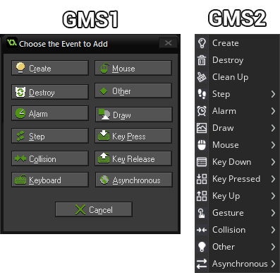

*Множество событий на выбор*

Вы помещаете код внутри события, и этот код работает в зависимости от типа события, в который вы его поместили. В GameMaker есть много событий, которые вы можете выбрать.  

Вот краткое введение в события, которые мы будем использовать больше всего:

## **Create** \(Создание\)

Код внутри события Create выполняется **только один раз**: когда экземпляр объекта, запускающий код, сначала создается. Здесь вы можете инициализировать большую часть основных переменных и/или придания движению объекту.

## Step \(Шаг\)

Самое важное и наиболее часто используемое событие - событие Step запускается каждый шаг - если для вашей скорости игры/комнаты установлено значение 30, событие Step будет выполняться 30 раз в секунду. Это можно использовать для вещей, которые должны, повторятся постоянно.

## Draw \(Рисование\)

Это событие используется для отрисовки. Например, такие функции, как `draw_sprite`, который используется для рисования спрайта, или `draw_rectangle`, который используется для рисования прямоугольника, работают только в событии Draw. Экземпляр объекта не будет отрисовываться _\(т.е. встроенный спрайт в сам объект\),_ при условии если в событие Draw "что-то" есть, поэтому чтобы избежать этого - используют **`draw_self()`**.

## Alarms \(Таймер\)

События таймера запускаются после их установки. Поэтому, если я установил Alarm 0 до 60 в событии Create, код внутри события Alarm 0 будет запущен через 60 шагов.

## Collision \(Столкновение\)

Добавляя событие столкновения, вы можете выбрать объект для создания события. Это событие будет выполняться только тогда, когда экземпляр, запускающий код, сталкивается с любым экземпляром объекта, указанным при создании события столкновения.
